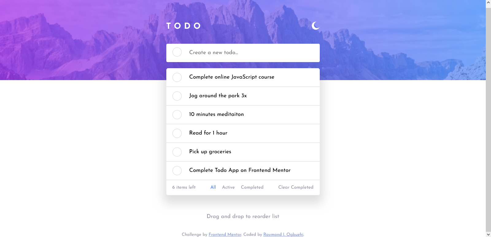

# Frontend Mentor - Todo app solution

This is a solution to the [Todo app challenge on Frontend Mentor](https://www.frontendmentor.io/challenges/todo-app-Su1_KokOW). Frontend Mentor challenges help you improve your coding skills by building realistic projects. 

## Table of contents

- [Overview](#overview)
  - [The challenge](#the-challenge)
  - [Screenshot](#screenshot)
  - [Links](#links)
- [My process](#my-process)
  - [Built with](#built-with)
  - [What I learned](#what-i-learned)
  - [Continued development](#continued-development)
  - [Useful resources](#useful-resources)
- [Author](#author)

## Overview

### The challenge

Users should be able to:

- View the optimal layout for the app depending on their device's screen size
- See hover states for all interactive elements on the page
- Add new todos to the list
- Mark todos as complete
- Delete todos from the list
- Filter by all/active/complete todos
- Clear all completed todos
- Toggle light and dark mode
- **Bonus**: Drag and drop to reorder items on the list

### Screenshot

### Links

- Solution URL: [https://github.com/Ihezie/Todo-List-App.git](https://github.com/Ihezie/Todo-List-App.git)
- Live Site URL: [https://simple-todo-website.netlify.app/](https://simple-todo-website.netlify.app/)

## My process

### Built with

- Semantic HTML5 markup
- CSS custom properties
- Flexbox
- Mobile-first workflow
- [React](https://reactjs.org/) - JS library
- [react-beautiful-dnd](https://github.com/atlassian/react-beautiful-dnd.git) - React library

### What I learned
- Styling a custom checkbox with CSS.
- Implementing the the react-beautiful-dnd library for the drag and drop functionality of the project.

### Continued development
In the future, I will definitely try to implement useful libraries in my web applications.

### Useful resources
- [LogRocket](https://blog.logrocket.com/adding-drag-and-drop-functionality-with-react-beautiful-dnd/) - This is an amazing article which helped me understand the basics of the react-beautiful-dnd library.

## Author
- Frontend Mentor - [@Ihezie](https://www.frontendmentor.io/profile/Ihezie)
